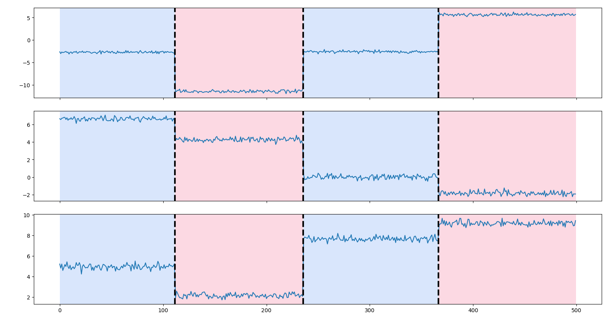

# tamis

Implementation in C, wrapped in Python of the exact solution by Block Coordinate Descent for fast detection of multiple change-points.

It follows the following paper :

* J.-P. Vert and K. Bleakley, "Fast detection of multiple change-points shared by many signals using group LARS", In J. Lafferty, C. K. I. Williams, J. Shawe-Taylor, R.S. Zemel and A. Culotta (Eds), Advances in Neural Information Processing Systems 23 (NIPS), p.2343-2351, 2010. [[paper]](https://members.cbio.mines-paristech.fr/~jvert/svn/ngs/Lasso/article/groupLARS/nips2010/nips2010.pdf) [[supplementary informations]](https://members.cbio.mines-paristech.fr/~jvert/svn/ngs/Lasso/article/groupLARS/nips2010/supplementary.pdf) [[poster]](https://members.cbio.mines-paristech.fr/~jvert/publi/nips2010poster/poster.pdf)

The Matlab implementation by the authors can be found [here](https://members.cbio.mines-paristech.fr/~jvert/svn/GFLseg/html/).

Details about the pseudo code by the same authors can be found [here](https://hal.archives-ouvertes.fr/hal-00602121).

This repository is the Python binding of the C implementation of [https://github.com/oboulant/block-coordinate-descent](https://github.com/oboulant/block-coordinate-descent).

## Local Build

If you are using `bash` :
```bash
> python -m pip install .[dev,display]
```

If you are using `zsh` :
```zsh
> python -m pip install .\[dev,display\]
```

## Contributing

If you wish to contribute, please install the pre-commit hooks. If you performed a previous local install with `python -m pip install .\[dev,display\]`, then the `pre-commit` package should already be installed. Then, you just have to tell `pre-commit` to install the hooks.

```
> pre-commit install
```

## Examples

### Run built-in example

```zsh
> python -m examples.example
```

### Code example

```python
import tamis as tam
import numpy as np
import ruptures as rpt
import matplotlib.pylab as plt


def get_default_weights(n):
    i = np.arange(1, n)
    return np.sqrt(n * 1.0 / (i * 1.0 * (n - i)))


#######################################
#   Generate signal
#######################################
n, dim = 500, 3  # number of samples, dimension
n_bkps, sigma = 3, 0.2  # number of change points, noise standard deviation
signal, bkps = rpt.pw_constant(n, dim, n_bkps, noise_std=sigma, seed=1234)

#######################################
#   Compute change points
#######################################
weights = get_default_weights(n)
regularization_lambda = 30.0
n_A, A, U = tam.ebcd(signal, weights, regularization_lambda)


#######################################
#   Communicate on results
#######################################
print(f"{n_A} break points found :")
print(list(A))
print(f"True break points are :")
print(bkps)

rpt.display(signal, bkps, A)
plt.show()
```



## Run tests

From the top directory :

```
> make test
```

It is to be noted that this repository being just a wrapper on the C implementation performed in [here](https://github.com/oboulant/block-coordinate-descent), tests in python only perform a high level test (we check that with a multidimensional signal without any noise, it outputs the true break points).

Unit tests are performed in C.
